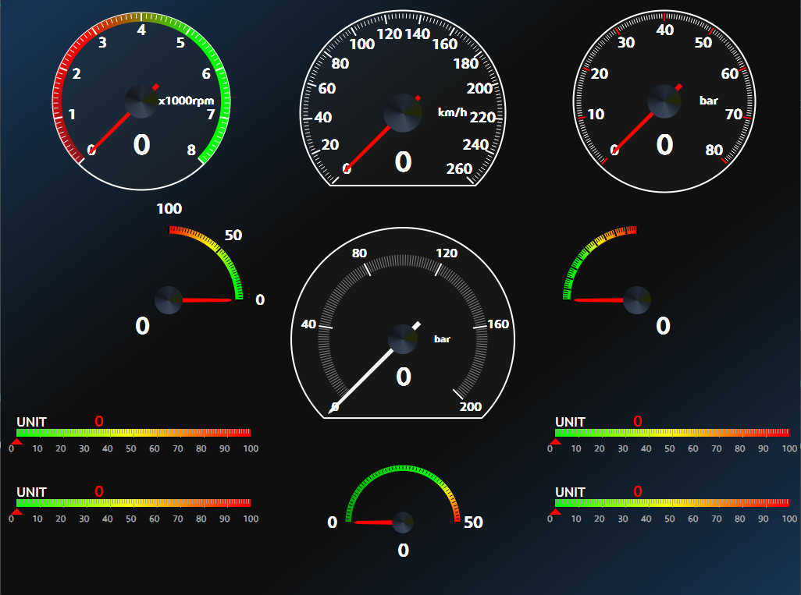
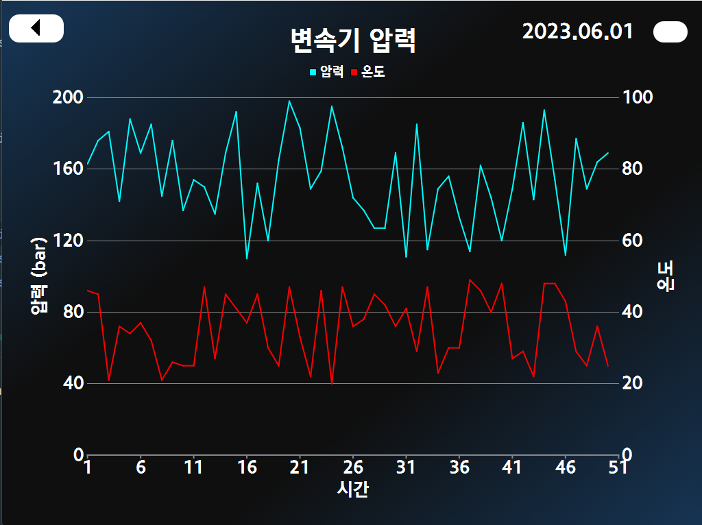
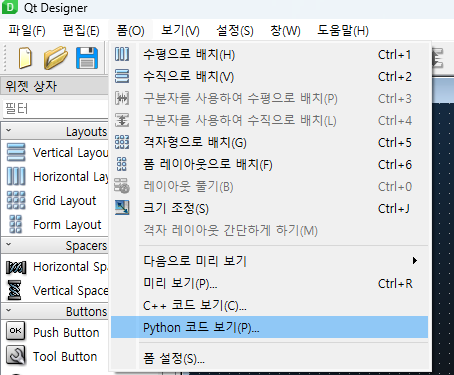
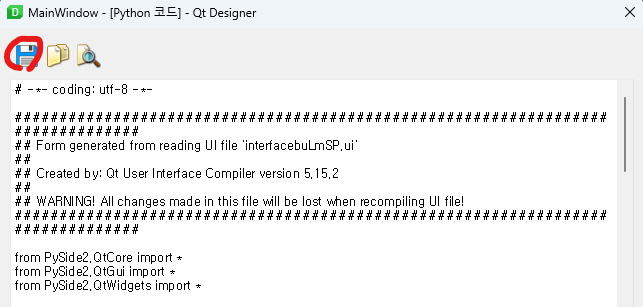
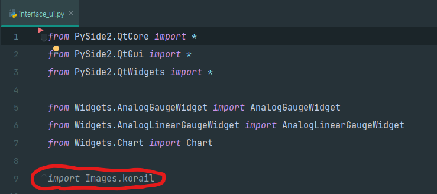
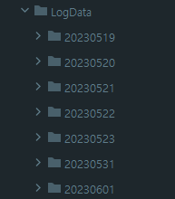

# KORAIL-Dashboard
## Description
* 견인용 철도 차량 디지털 현시 장치를 위한 프로그램입니다.
* python 기반으로 개발 중이며 GUI 라이브러리인 PySide2를 사용합니다. 
* 실제 철도 차량 하드웨어 장치 간 통신을 통해 계기판의 실시간 갱신과 각 데이터를 기록합니다.
  * 장치 간 통신은 구현 되지 않았습니다.
* 계기판을 클릭(터치) 시 계기판 별 기록된 데이터를 시각화하여 그래프를 보여줍니다.


## Image
### 초기 로고 화면

### 메인 화면

### 그래프 화면

## Requirement
**python version**
`python: 3.8.x  `

**Library**
```commandline
pip install pyside2
pip install numpy
```
## References
* 계기판 Widget
  * https://khamisikibet.github.io/QT-PyQt-PySide-Custom-Widgets/docs/custom-analog-gauge.html
  * https://github.com/KhamisiKibet/QT-PyQt-PySide-Custom-Widgets
  * https://github.com/tschoonj/GTK-for-Windows-Runtime-Environment-Installer/releases
  * https://www.youtube.com/watch?v=5WHnlRQcUy4&feature=youtu.be
## Notes
* pyqt5와 달리 pyside2는 Qt Designer 에서 수정 시 UI를 파이썬 파일로 저장하여 바인딩됩니다.
  * `수정 후 상단 폼 -> Python code 보기 -> 저장 아이콘 클릭`
  * 
  * 
  * interface_ui.py에서 getUiList() 함수를 추가 하여 주시면 됩니다.
  * ```
    def getUiList(self):
        return [self.label, self.widget_1, self.widget_2, self.widget_3, self.widget_4, self.widget_5,
                self.widget_6, self.widget_7, self.widget_8, self.widget_9, self.widget_10, self.widget_11, self.toolButton,
                self.toolButton_calendar, self.pushButton_update]
* KORAIL 로고 관련 이슈
  * Qt Designer 수정 및 업데이트 후 interface_ui.py를 열면 상측 import 부분에 Korail 이미지 부분 수정이 필요합니다.
    * `import Images.korail` 코드 추가
    * 
* 각 계기판의 디자인은 Reference에 명시된 계기판 Widget 관련 자료를 통해 개발되었습니다.
  * AnalogGaugeWidget.py: 원 계기판
  * LinearGaugeWidget.py: 막대 계기판
* 하나의 계기판에서 각 컴포넌트들을 커스텀 제작 하였습니다.
  * 소자 별 길이, 색, 배경, 각도 등 
  * 각 계기판의 디자인은 JSON 파일을 통해 수정 가능 하며, Reference에 명시된 자료 및 영상을 참고 바랍니다.
  * 그래프 화면의 경우 임의의 데이터를 생성하여 보여주고 있습니다.
    * 임의의 데이터를 생성할 경우 Utils 폴더의 DataLogging.py를 실행 하여 데이터를 생성하면 됩니다.
      ```
      if __name__ == '__main__':
      date = time.strftime('%Y%m%d') # 오늘 날짜 (type: str), '20230601'
      dataLogging('widget', date) # date 값 임의 변경 가능
      ```
    * 데이터 생성 되는 위치는 /LogData/ 입니다.
    * 
